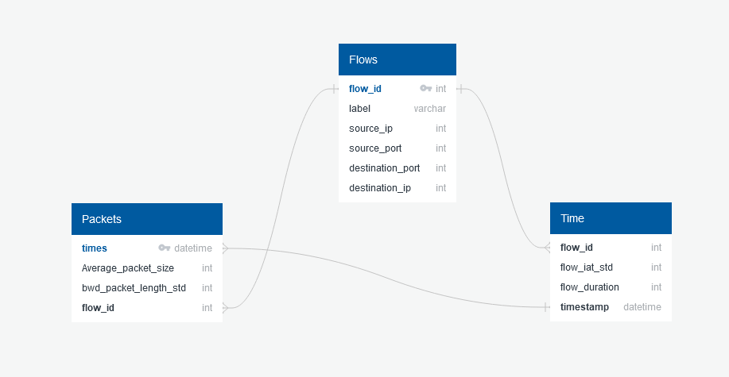
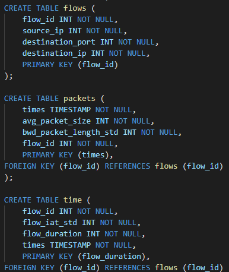
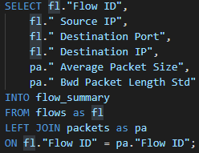
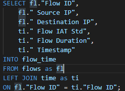
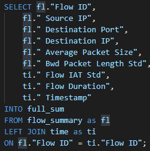

# CSI Database:

## Schema
After discussing which columns of the database we chose were most important to answer the questions we had, I set out to work on the schema and code to start creating the new database for our project.

I have separated the data into different tables based on their relevance to each category: destination, volume, and time. Using their flow identification number, I have separated them to that they can be connected in groups of 2 or all together, allowing for the comparison of smaller parts of the database if necessary.

## Database

Each table holds the amount of transactions, the size of the transactions, and the length of each transaction.

## Joins

The joins allow for tables to be created to compare two of the previous tables or they can all be joined to see the original table.

